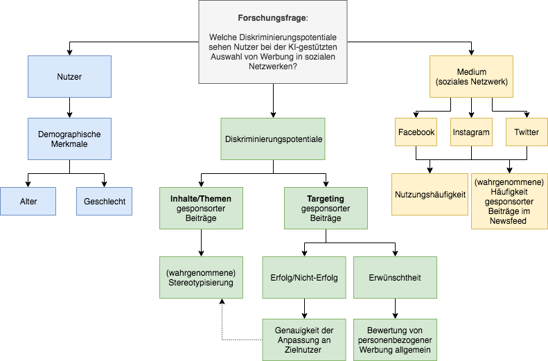

# Diskriminierung durch Künstliche Intelligenz
Kleingruppe zum Forschungsthema "Diskriminierung durch Künstliche Intelligenz"

Forschungsfrage: "Welche Diskriminierungspotentiale sehen Nutzer bei der KI-gestützten Auswahl von Werbung in sozialen Netzwerken?"

**Mitglieder**
Insa Menzel
Leonie Düttmann
Nathalie Meissner
Julia May
Tom Gerlach

**Faktorenraum**

